# AI Recruitment & Resume Screening System

## Cover Page

**Project Title:** AI Recruitment & Resume Screening System

**Prepared by:**

- Youssef Emad — ID: 225241
- Omar Tokal — ID: 225238
- Amr Hamdy — ID: 225182
- Zeyad Mostafa — ID: 225070

**Course:** AI Application

**Instructor:** Mohamed Gonid

**University:** Egyptian Russian University

This report documents the implemented Streamlit project as a decision-support system for AI-assisted recruitment and resume screening. It is not a final hiring decision maker.

## Table of Contents

1. Abstract
2. Introduction
3. Related Work
4. Dataset / Data
5. Tools and Technologies
6. Methodology
7. Implementation
8. Diagrams and Visualization
9. Results and Testing
10. Screenshots of Run
11. Limitations
12. Future Work
13. Conclusion
14. References

## 1. ABSTRACT

The AI Recruitment & Resume Screening System is a Streamlit-based platform for supporting recruitment and resume screening workflows. It connects CV upload, resume parsing, semantic resume ranking, job-description bias detection, synthetic CV generation, resume style transformation, a RAG assistant, and dashboard visualizations inside one user interface.

The system uses OpenAI-powered language model and embedding features when `OPENAI_API_KEY` is configured. When the API key is not available, several modules provide simple demo fallbacks so the application can still be explored. The system is designed as a decision-support tool for recruiters and HR teams. It does not make final hiring decisions, and all candidate-related outputs require human review.

## 2. INTRODUCTION

Manual resume screening is time-consuming, especially when recruiters receive many CVs for one role. Resumes vary in structure, wording, length, and formatting, which makes direct comparison difficult. Traditional keyword-based screening can miss qualified candidates who describe the same skills using different terms.

HR teams need faster tools that can summarize candidate information, compare resumes with job descriptions, and explain why a candidate appears relevant. At the same time, recruitment tools must be used carefully because automated systems can introduce or amplify unfair screening behavior. Fairness checks, neutral job descriptions, source-based answers, and human review are important parts of responsible recruitment support.

The aim of this project is to build a demo-level AI recruitment platform that connects multiple recruitment services into one Streamlit UI. The implemented system helps upload and parse CVs, rank candidates, detect biased wording, generate synthetic data for testing, transform resume style, ask questions over uploaded resumes, and review metrics through a dashboard.

## 3. RELATED WORK

### A. Traditional Resume Screening and Applicant Tracking Systems

Traditional Applicant Tracking Systems and resume screening tools help HR teams filter large numbers of applicants. Many earlier systems depend on keyword matching, rule-based filtering, TF-IDF, cosine similarity, and simple machine learning models. These tools can reduce manual effort, but they often struggle when candidates use different words for the same skill, when resumes have different formats, or when the system depends too much on exact keywords. They can also miss semantic meaning and may reflect biased screening criteria.

Relation to this project: this project solves the same screening problem, but it improves the matching step by using semantic embeddings when OpenAI is configured instead of only keyword matching. It also adds explanation, bias detection, RAG-based questioning, and a full Streamlit UI.

### B. Semantic Resume Matching Using Embeddings

Modern matching systems use embeddings to represent resumes and job descriptions as vectors. This allows the system to compare the meaning of texts, not only exact words. Embeddings are useful for search, clustering, recommendations, classification, and measuring relatedness between pieces of text.

Relation to this project: the Resume Ranking module uses OpenAI embeddings to calculate similarity between uploaded CV text and the job description when an API key is configured. The similarity score is then used to rank candidates. The LLM is used to explain the result, but the score itself comes from embedding similarity. Without an API key, the implemented fallback uses keyword overlap.

### C. Retrieval-Augmented Generation for Resume Analysis

Retrieval-Augmented Generation, or RAG, combines a retrieval system with a language model. Instead of asking the LLM to answer from memory only, the system first retrieves relevant text chunks from documents, then asks the model to answer using that context. This improves grounding and helps provide source-based answers.

Relation to this project: the RAG Assistant works over uploaded CVs. It chunks CV text, retrieves the most relevant chunks using similarity search when embeddings are available, and then uses the LLM to answer recruiter questions based only on the retrieved CV content. It also shows source CV names and snippets. Without an API key, retrieval falls back to keyword overlap and provides a demo answer.

### D. Synthetic Resume Data Generation

Synthetic data is useful when real recruitment data is limited, private, or hard to collect. In recruitment projects, synthetic CVs can be used for testing, demonstration, and balancing different job categories. Generative models such as GANs can be used for synthetic data generation, but training a real GAN for resumes is more advanced.

Relation to this project: the Synthetic CV Generation module simulates GAN-generated CV data for demo purposes. It generates structured CV records with name, job category, skills, education, years of experience, projects, certifications, and resume text. This module can later be replaced by a real GAN or a more advanced LLM-based generator.

### E. Bias and Fairness in AI Recruitment

AI recruitment systems can improve efficiency, but they can also create or amplify bias. A known example is Amazon's experimental AI recruiting tool, which was reported to show bias against women because it learned from historical hiring data. Fairness guidance from employment and AI risk management organizations emphasizes the need for human oversight, fairness checks, and avoiding discrimination in employment-related AI tools.

Relation to this project: the Bias Detection module checks job descriptions for biased or exclusionary words related to age, gender, nationality/language, and aggressive wording. It suggests neutral alternatives and helps make job descriptions more inclusive. The system also clearly states that final hiring decisions require human review.

### F. LLMs for Explanation and Style Transformation

Large language models can help explain candidate-job matches, rewrite job descriptions, improve resume wording, and answer recruiter questions. However, LLMs may hallucinate if they are not controlled. Recruitment systems should avoid inventing skills, experience, education, or certificates, and should rely on uploaded CV content when answering candidate-related questions.

Relation to this project: the project uses an OpenAI LLM for candidate explanations, resume style transformation, neutral job description rewriting, synthetic CV text generation when configured, and RAG answers. The prompts are designed to avoid final hiring decisions and to remind users that the system is only a decision-support tool.

### Relation to the Proposed System

The proposed system combines resume upload and parsing, AI-powered resume ranking, bias detection, synthetic CV generation, style transformation, RAG assistant functionality, and dashboard visualizations inside one Streamlit UI. All services are connected to Streamlit pages, allowing the user to move through the recruitment support workflow from CV upload to analysis and presentation-ready charts.

## 4. DATASET / DATA

The project uses a local set of 20 Data Engineer CV files for testing and demonstration. The documentation and screenshots do not expose private personal details from these CV files.

Uploaded CVs are stored locally under the project data folders and processed into structured CSV records. Extracted CV text is saved in `data/processed/cvs.csv` and is used by the ranking, RAG assistant, dashboard, and related workflows. Ranking outputs are stored in `data/processed/ranking_results.csv`. RAG embedding cache data is stored under `data/vector_db/` when embeddings are generated.

Synthetic CVs are generated for demo and testing purposes and saved in `data/synthetic/synthetic_cvs.csv`. Generated synthetic records include fields such as name, job category, skills, education, years of experience, projects, certifications, and resume text. The synthetic CV module can also create downloadable PDF resumes for generated fake candidates.

## 5. TOOLS AND TECHNOLOGIES

| Tool / Technology | Use in the Project |
| --- | --- |
| Streamlit | Multipage user interface for the recruitment workflow. |
| Python | Backend logic, service functions, file handling, parsing, ranking, and report generation. |
| OpenAI Embeddings | Semantic resume ranking and RAG retrieval when `OPENAI_API_KEY` is configured. |
| OpenAI LLM | Candidate explanations, neutral rewriting, resume style transformation, synthetic resume text generation, and RAG answers. |
| PDF/DOCX parsers | Resume text extraction using PDF and DOCX parsing libraries. |
| CSV local storage | Stores CV records, ranking results, and synthetic CVs locally. |
| Playwright | Browser automation for screenshot capture and PDF export. |
| Pillow static diagrams | Generates professional PNG architecture and workflow diagrams for the documentation. |
| Plotly / Charts | Dashboard visualizations, ranking charts, bias charts, and synthetic CV charts. |

## 6. METHODOLOGY

The system follows a clear recruitment support workflow:

CV upload → text extraction → local storage → resume ranking → bias detection → synthetic CV generation → style transformation → RAG assistant → dashboard review.

First, the user uploads PDF or DOCX CV files through the Streamlit interface. The resume parser extracts plain text and the storage service saves structured CV records locally. The ranking module then compares the uploaded CV text with a job description using OpenAI embeddings when available, or a keyword-based fallback when the API key is not configured.

The bias detection module analyzes job descriptions for listed biased or exclusionary terms and suggests neutral alternatives. The synthetic CV module creates fake candidate records for demonstration and testing. The style transformation module rewrites resume text into selected formats while preserving the original facts. The RAG assistant chunks uploaded CV text, retrieves relevant snippets, and answers recruiter questions using retrieved context. Finally, the dashboard combines metrics and charts from the stored CV, ranking, synthetic, and RAG data.

This workflow supports recruitment screening and presentation, but final candidate decisions remain the responsibility of human reviewers.

## 7. IMPLEMENTATION

The project is implemented as a Streamlit multipage application. The main UI entry point is `app.py`, and each feature page in `pages/` connects to service functions in `services/`.

### Streamlit Pages

- `app.py`: Home page for the AI Recruitment & Resume Screening System. It displays project status, uploaded CV count, ranked candidate count, average match score, synthetic CV count, module cards, workflow steps, and a decision-support warning.
- `pages/1_Upload_CVs.py`: Uploads PDF and DOCX resumes, saves uploaded files locally, extracts text, creates candidate records, and displays uploaded CV metadata and extracted text previews.
- `pages/2_Resume_Ranking.py`: Accepts a job description, ranks uploaded CVs, saves ranking results, displays candidate score summaries, matched skills, missing skills, explanations, tables, filters, and a ranking score chart.
- `pages/3_Bias_Detection.py`: Accepts a job description, detects listed biased terms, suggests neutral alternatives, displays findings in summary/table/chart views, and can rewrite text neutrally with OpenAI when configured.
- `pages/4_Synthetic_CV_Generation.py`: Generates synthetic CVs by job category or from job requirements, saves synthetic records, creates PDF output, and displays synthetic CV tables and distribution charts.
- `pages/5_Style_Transformation.py`: Uploads or accepts resume text, transforms it into professional, ATS-friendly, or short summary style, and produces downloadable PDF output.
- `pages/6_RAG_Assistant.py`: Builds CV chunks from uploaded resumes, retrieves relevant chunks for a question, answers with RAG, and displays source snippets for review.
- `pages/7_Dashboard.py`: Displays overall metrics, ranking charts, synthetic CV charts, RAG index status, and a skills frequency chart based on extracted CV text.

### Services

- `services/openai_service.py`: Central OpenAI wrapper. It loads environment variables, checks whether `OPENAI_API_KEY` exists, creates the OpenAI client, generates text using the configured model, creates embeddings using the configured embedding model, and calculates cosine similarity.
- `services/resume_parser.py`: Extracts text from PDF and DOCX files using `pdfplumber`, `PyPDF2`, and `python-docx`. It also cleans resume text and estimates a candidate name from the resume text or file name.
- `services/ranking_service.py`: Extracts common skills, finds matched and missing skills, computes candidate-job similarity with OpenAI embeddings when available, falls back to keyword overlap otherwise, and generates candidate explanations.
- `services/bias_detection_service.py`: Contains a dictionary of biased terms and neutral alternatives, detects terms in job descriptions, and rewrites job descriptions neutrally with OpenAI when configured.
- `services/synthetic_cv_service.py`: Generates fake structured CV records by category, builds fallback resume text, extracts requirement skills, generates job responsibilities, and can create a high-match fake CV from requirements. It simulates GAN-generated CV data for demo purposes.
- `services/style_transformer_service.py`: Transforms resume text using OpenAI or a rule-based fallback and creates formatted PDF resume bytes with ReportLab.
- `services/rag_service.py`: Chunks CV text, builds retrieval records, retrieves relevant chunks using embeddings or keyword overlap, caches chunk embeddings, reports index status, and answers questions using retrieved CV context.
- `services/storage_service.py`: Creates local data directories and reads/writes uploaded CV records, ranking results, and synthetic CV records as CSV files.

All listed services are connected to the Streamlit UI through the page files. The app keeps page code focused on interface controls and delegates parsing, ranking, bias detection, synthetic generation, style transformation, RAG, and storage work to reusable services.

## 8. DIAGRAMS AND VISUALIZATION

### Figure 1. System Architecture Diagram

Figure 1 shows the main architecture of the system. The Streamlit UI connects feature pages to reusable service modules, local data storage, the vector cache, and OpenAI services when configured.

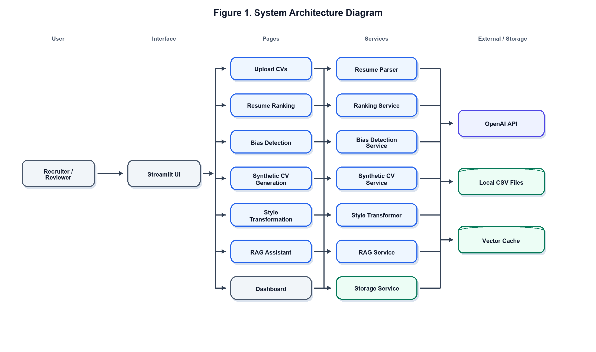

*Figure 1. System Architecture Diagram.*

### Figure 2. Streamlit UI Navigation Diagram

Figure 2 summarizes the user navigation structure. The sidebar exposes the home page and each major recruitment module.

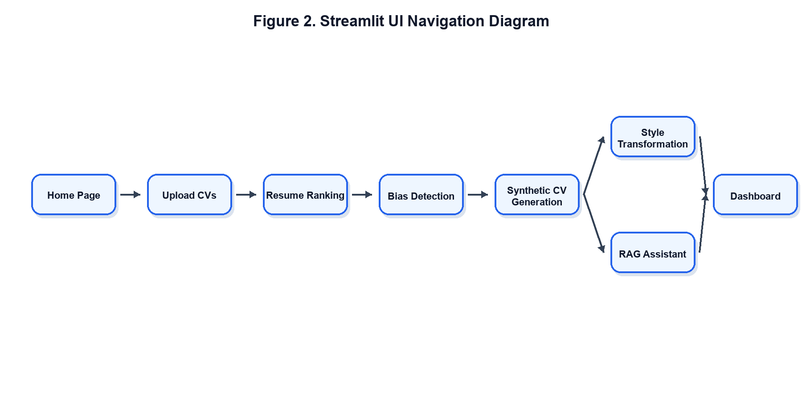

*Figure 2. Streamlit UI Navigation Diagram.*

### Figure 3. Resume Ranking Flow

Figure 3 shows how the ranking page loads CV records, compares resumes with the job description, calculates scores, and saves/display results.

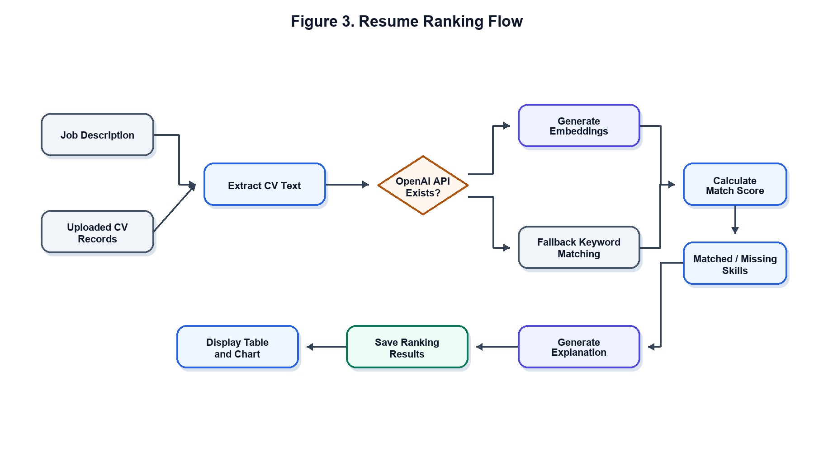

*Figure 3. Resume Ranking Flow.*

### Figure 4. Bias Detection Flow

Figure 4 shows how job-description text is checked against the bias term dictionary and optionally rewritten with neutral wording.

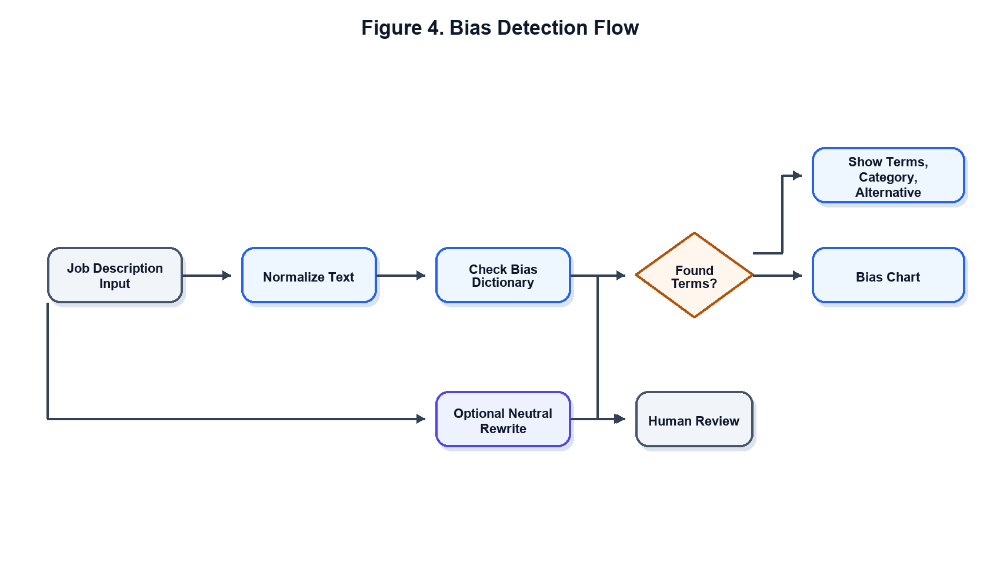

*Figure 4. Bias Detection Flow.*

### Figure 5. RAG Pipeline

Figure 5 explains the RAG assistant. Uploaded CV text is chunked, relevant snippets are retrieved, and the answer is generated from the retrieved context.

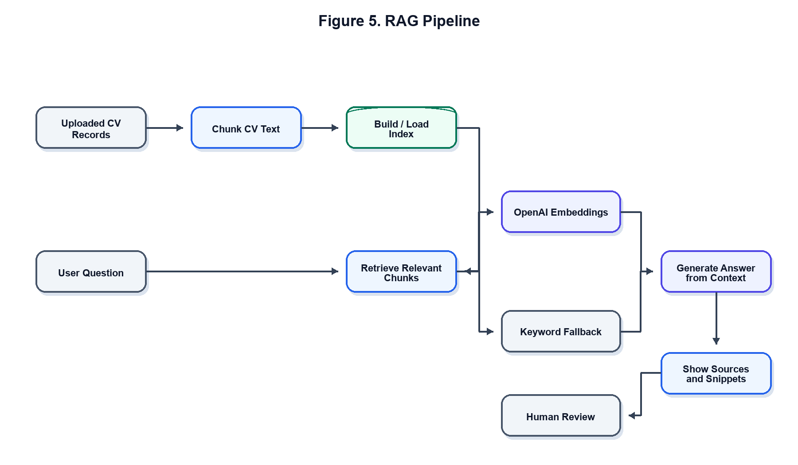

*Figure 5. RAG Pipeline.*

### Figure 6. Synthetic CV Generation Flow

Figure 6 shows the synthetic CV generation flow. It supports category-based generation and requirements-based high-match fake CV generation.

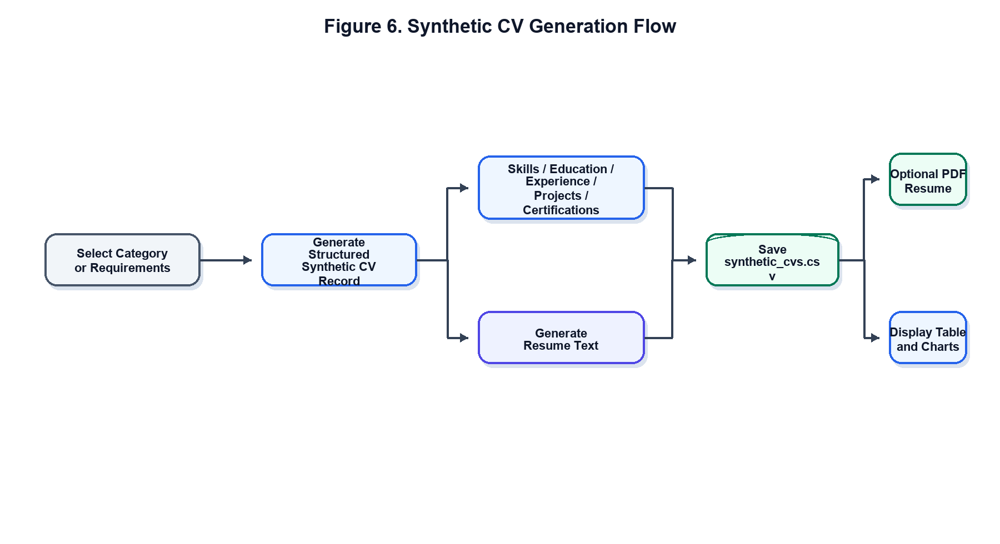

*Figure 6. Synthetic CV Generation Flow.*

### Implemented App Visualizations

The implemented application includes these visualizations. The actual UI chart screenshots are included in the Screenshots of Run section:

- Ranking score chart in the Resume Ranking page.
- Bias category chart in the Bias Detection page.
- Synthetic CV distribution charts by job category and years of experience.
- Dashboard metrics and charts for uploaded CVs, ranking results, synthetic CVs, and RAG status.
- Skills frequency chart in the Dashboard page.

## 9. RESULTS AND TESTING

The following results were validated from the current local project data and running Streamlit app:

| Validation Item | Result |
| --- | --- |
| CV records | 20 |
| Ranking results | 20 |
| Synthetic CVs | 35 |
| RAG chunks | 111 |
| Cached RAG chunks | 111 |
| Average match score | 52.8% |
| Streamlit HTTP check | 200 OK |
| CV parsing | 20 successful, 0 failed |

These results confirm that the implemented services are connected end-to-end through the Streamlit UI. Uploaded CVs are parsed and saved, ranking results are available, synthetic CV data is stored, the RAG index is built and cached, and the dashboard reads from the local processed data.

## 10. SCREENSHOTS OF RUN

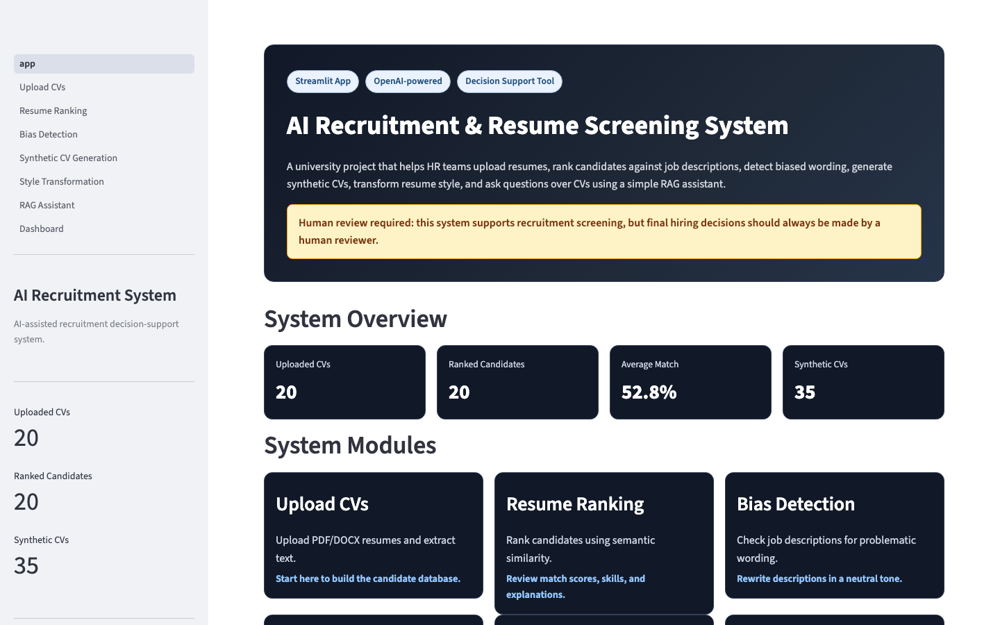

Figure 7. The home page shows the project overview, current local data counts, module cards, workflow steps, and the human-review warning.

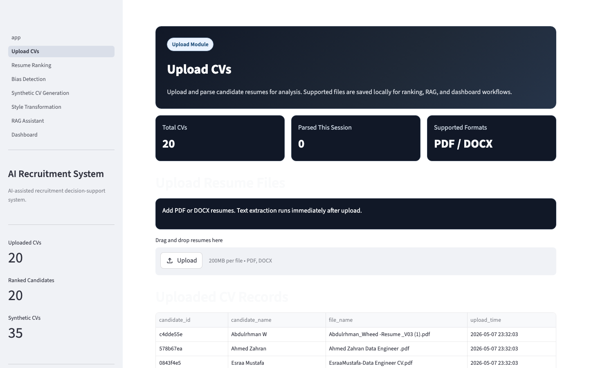

Figure 8. The Upload CVs page provides PDF/DOCX upload, local parsing, stored candidate records, and extracted text preview. Private CV details are not exposed in the documentation.

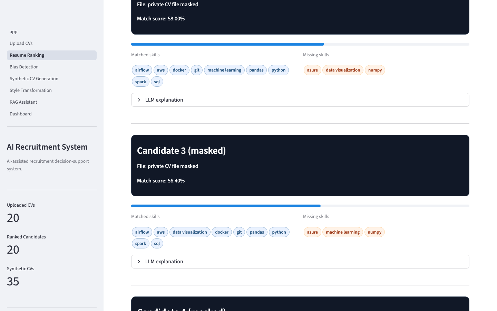

Figure 9. The Resume Ranking page displays ranking results, filters, score outputs, and candidate comparison controls. Private candidate names and file names are masked in the screenshot.

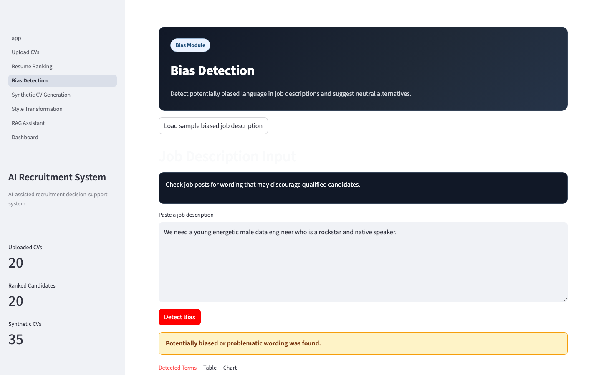

Figure 10. The Bias Detection page shows detected biased terms from a sample job description and provides neutral alternatives.

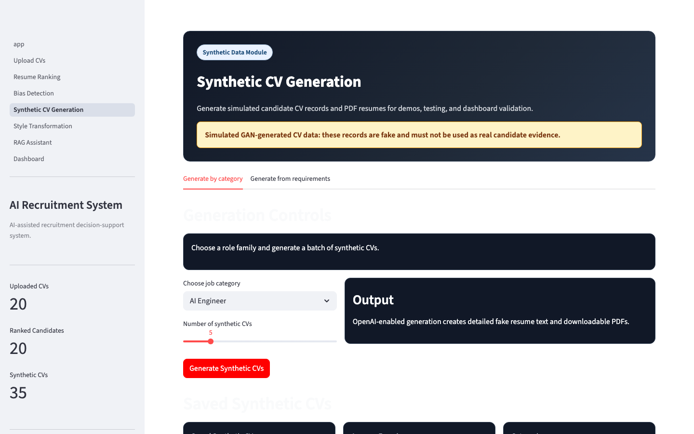

Figure 11. The Synthetic CV Generation page shows generated fake CV records and saved synthetic data for testing and presentation.

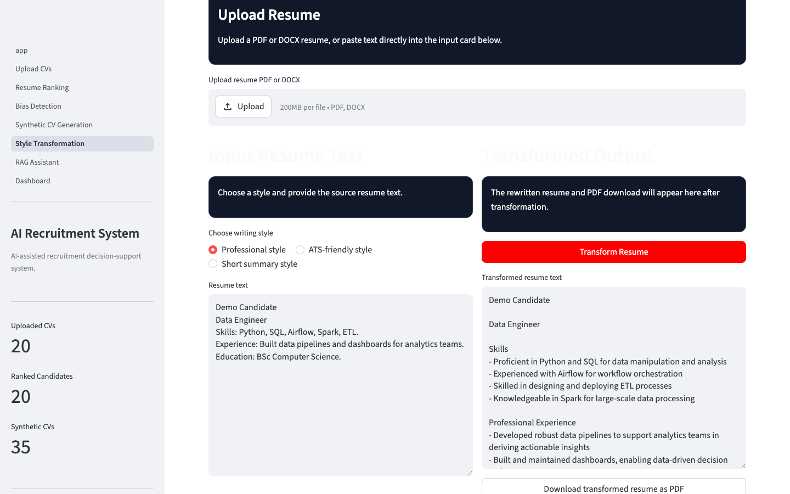

Figure 12. The Style Transformation page shows transformed output from sample resume text and a PDF download option.

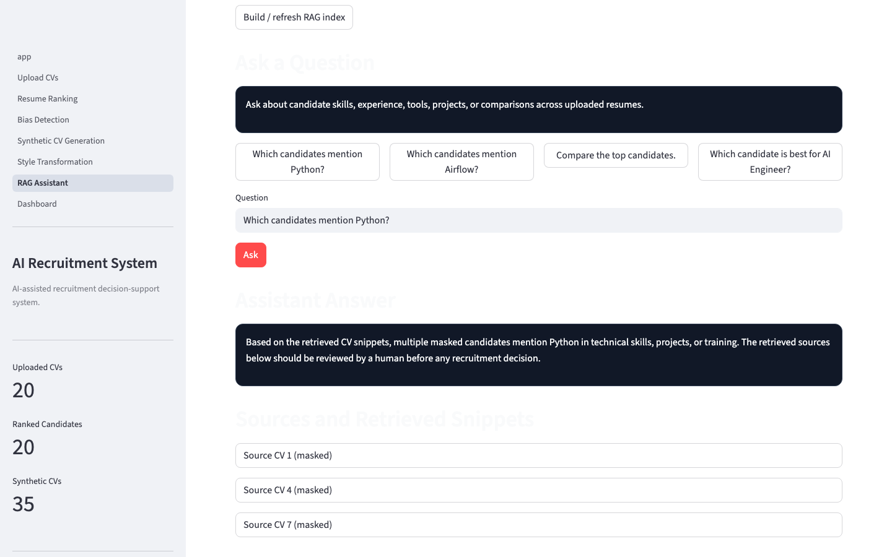

Figure 13. The RAG Assistant page shows an answer and retrieved source snippets. Private source labels are masked in the screenshot.

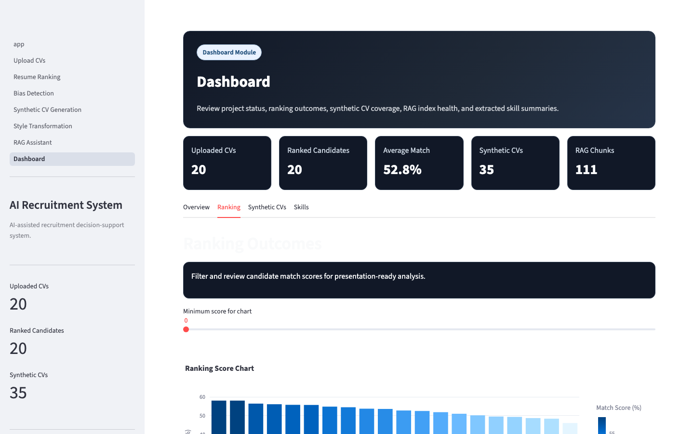

Figure 14. The Dashboard page summarizes uploaded CVs, ranking results, synthetic CV coverage, RAG chunk status, and visualization tabs.

## 11. LIMITATIONS

- The dataset is limited to 20 CVs, so results should be treated as a project demonstration rather than broad hiring evidence.
- Synthetic CV generation is simulated and is not a real trained GAN.
- LLM output may vary between runs depending on model behavior and prompts.
- Human review is required for all candidate-related results.
- The system is academic/demo-level software and is not production hiring software.

## 12. FUTURE WORK

- Use a larger and more diverse CV dataset.
- Replace simulated synthetic generation with a real GAN or more advanced controlled generator.
- Add advanced fairness metrics beyond dictionary-based wording checks.
- Add authentication and user roles.
- Use a database instead of CSV-only local storage.
- Deploy the app online.
- Add better ranking evaluation metrics, such as precision, recall, human-labeled relevance checks, and benchmark comparisons.

## 13. CONCLUSION

The AI Recruitment & Resume Screening System successfully connects multiple AI recruitment services into one Streamlit UI. It supports resume upload and parsing, resume analysis, semantic ranking, bias detection, synthetic data generation, resume style transformation, RAG-based questions, and dashboard visualizations.

The project improves demo-level recruitment screening by organizing candidate data and making screening outputs easier to inspect. However, it remains a decision-support tool. It should not be used as a final hiring decision maker, and all results should be reviewed by a human.

## 14. REFERENCES

1. OpenAI. "OpenAI API Documentation." Official documentation for language models, embeddings, and API usage.
2. Streamlit. "Streamlit Documentation." Official documentation for building and deploying Streamlit applications.
3. Lewis, P. et al. "Retrieval-Augmented Generation for Knowledge-Intensive NLP Tasks." NeurIPS, 2020.
4. Reuters. "Amazon scraps secret AI recruiting tool that showed bias against women." Reuters technology report, 2018.
5. U.S. Equal Employment Opportunity Commission. "Artificial Intelligence and Algorithmic Fairness Initiative." Employment guidance and technical assistance.
6. National Institute of Standards and Technology. "AI Risk Management Framework." NIST AI RMF 1.0.
7. Research and industry literature on Applicant Tracking Systems, NLP-based resume screening, semantic matching, and recruitment decision-support tools.
